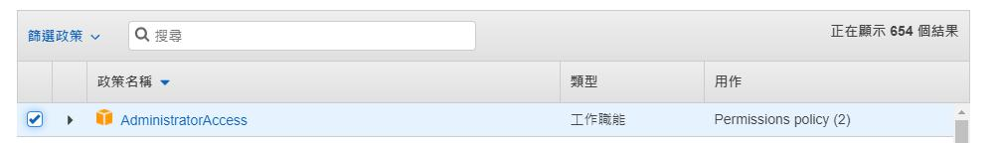
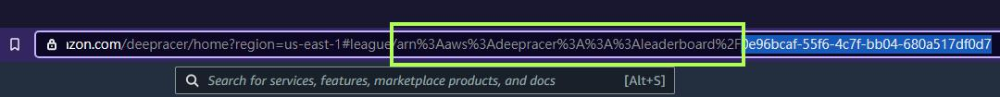

# Deepracer AutoSubmit League

This is a simple macro based on selenium for AWS DeepRacer League. You can use to submit module.

## Setup
When using it for the first time, please go to `config.ini` file to set up your IAM AWS account.

Also you need to create the IAM user for this bot Login


You just need to input you AUTH info and your Summit Model Name then you can use it to free your hand.

## Please follow the image to find the League name on browser


## Installation (Ubuntu)
```bash
sudo apt update
sudo apt install -y xvfb jq
sudo apt install -y chromium-browser
sudo apt install -y chromium-codecs-ffmpeg
sudo apt install -y chromium-chromedriver
```

## Quick Start
Make Sure you chrome version is `85.0.4183.102`
If the version it not match please go to https://sites.google.com/a/chromium.org/chromedriver/downloads

```bash
git clone https://github.com/lshw54/deepracer-autosubmit.git
cd deepracer-autosubmit
pip3 install -r requirements.txt
python3 main.py
```
